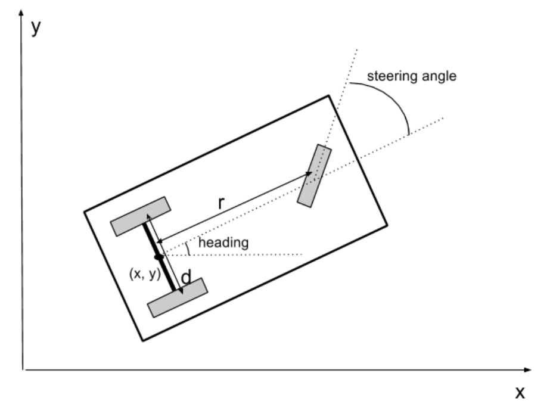

# 2D-Pose Estimator for Tricycle Model

## Project Overview

The goal of this repository is to create an estimator for the 2D-pose (X, Y, Heading) of a tricycle-model based mobile platform following the figure below,

 

where the mobile platform is a wheeled tricycle with a steering mechanism attached to the, single, front wheel, in order to control the steering angle. From the figure,​ ***r*** is the distance from the front wheel to back axis, and​ ***d*** is a distance between​​ the​ rear​ wheels. The platform's Center-of-Body (COB) is located at the center of the rear axis, in between the two back wheels (in-line with the front wheel's pivot-point). Additionally, the mobile platform's estimated pose is the estimated location of the COB, relative to the world coordinate frame.

The 2D-pose is estimated through the fusion of the available sensor measurements, using the tricycle-model based kinematic equations. My specific implementation operates under the assumption that the front wheel has a traction motor attached to it (driving force of the mobile platform), and has the available sensor measurements:

- incremental encoder - attached to the front wheel's traction motor, measuring wheel rotation (ticks)

- absolute encoder - attached to the front wheel's steering mechanism, measuring estimated steering angle (radians)

- gyroscope - attached at COB, measuring the angular velocity of the platform's COB about the Z-axis (radians / sec)

### Model Assumptions and Constraints

My pose-estimator makes the following assumptions on the tricycle model used:

- The Right-Hand Coordinate System (RHS) is used, where +Z is up, +X is forward, +Y is to the left, and +Yaw/Heading is counter-clockwise (CCW) about the +Z-axis.

- The front wheel's steering mechanism can rotate +/- 90 degrees, about the +Z-axis.

- The movement of the platform is strictly 2D, and has no changes in elevation (i.e z=0 for all time)

- The platform is expected to go straight when the steering angle is 0 degrees.

- **Currently** No wheel-slippage
- **Currently** Minimal sensor noise, (if any)

### Default Physical Parameters

- Front Wheel Radius = 0.2 [m]
- Rear Wheel Radius = 0.2 [m]
- Distance from front wheel to back axis (***r***) = 1.0 [m]
- Distance between rear wheels (***d***) = 0.75 [m]

- Front-wheel encoder resolution = 512 [ticks / revolution]

- Initial Pose (***x0***) [x,y,heading] = [0, 0, 0]

## Repository Overview

This repository is broken up into 3 sections:

- **python:** This directory contains the Python 2.7 implementation of the pose-estimator, as well as data-log processing utilities, useful for quick verification of pose-estimator functionality and performance. (*Main Reason:* easy way to quickly tune sensor-fusion parameters)

- ** *(Optional)* data:** This directory contains the raw and post-processed simulated data generated through the usage of the *tricycle_description* package to simulate the control of a tricycle drive mobile platform, in the absence of physical hardware.

- ** *(Optional)* tricycle_description: ** This directory contains the [ROS](http://www.ros.org/)-package used to generate a 3D-tricycle, joystick-controllable, model, used to generate, and collect, simulated sensor, and ground truth, data used to verify the corrected-ness of the pose estimator.

- ** *(TODO)* cxx: ** This directory contains the C++ implementation of the pose-estimator, which is useful for real-time execution of pose-estimator on embedded systems (i.e Raspberry Pi, Arduino, etc.)

The code documented herein is a work in progress.

### Dependencies

**USER NOTE:** The remaining sections will focus primarily on the **python** directory as this is the current (main) focus of the development.

This project requires **Python 2.7** and the following Python libraries installed:

- [NumPy](http://www.numpy.org/)

## Implementation

**TODO** Elaborate a bit more.

### Sensor-Fusion Implementation

My implementation for this pose-estimator utilizes a very simple Extended Kalman Filter (EKF), do to the non-linearities inherent in the tricycle-model kinematics.

**TODO**

### Data Generation

**TODO**

### Preliminary Results

**TODO**

## Developer Notes ##

### TODOs ###

- Modify ROS tricycle drive plugin to better reflect specific model assumptions
- Develop C++ skeleton

### Maintainer ###

Hunter Young (hunter.lw.young@gmail.com)
