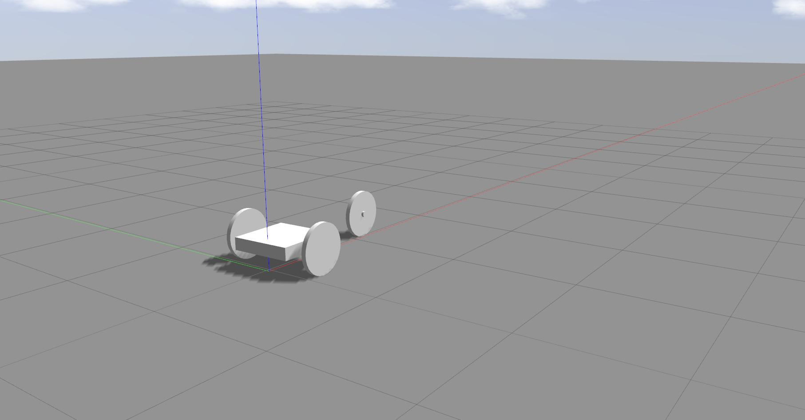

# 2D-Pose Estimator for Tricycle Model

## Project Overview

The goal of this repository is to create an estimator for the 2D-pose (X, Y, Heading) of a tricycle-model based mobile platform following the figure below,

 

where the mobile platform is a wheeled tricycle with a steering mechanism attached to the, single, front wheel, in order to control the steering angle. From the figure,​ ***r*** is the distance from the front wheel to back axis, and​ ***d*** is a distance between​​ the​ rear​ wheels. The platform's Center-of-Body (COB) is located at the center of the rear axis, in between the two back wheels (in-line with the front wheel's pivot-point). Additionally, the mobile platform's estimated pose is the estimated location of the COB, relative to the world coordinate frame.

The 2D-pose is estimated through the fusion of the available sensor measurements, using the tricycle-model based kinematic equations. My specific implementation operates under the assumption that the front wheel has a traction motor attached to it (driving force of the mobile platform), and has the available sensor measurements:

- incremental encoder - attached to the front wheel's traction motor, measuring wheel rotation (ticks)

- absolute encoder - attached to the front wheel's steering mechanism, measuring estimated steering angle (radians)

- gyroscope - attached at COB, measuring the angular velocity of the platform's COB about the Z-axis (radians / sec)

### Model Assumptions and Constraints

My pose-estimator makes the following assumptions on the tricycle model used:

- The Right-Hand Coordinate System (RHS) is used, where +Z is up, +X is forward, +Y is to the left, and +Yaw/Heading is counter-clockwise (CCW) about the +Z-axis.

- The front wheel's steering mechanism can rotate +/- 90 degrees, about the +Z-axis.

- The movement of the platform is strictly 2D, and has no changes in elevation (i.e z=0 for all time)

- The platform is expected to go straight when the steering angle is 0 degrees.

- **Currently** No wheel-slippage
- **Currently** Minimal sensor noise, (if any)

### Default Physical Parameters

- Front Wheel Radius = 0.2 [m]
- Rear Wheel Radius = 0.2 [m]
- Distance from front wheel to back axis (***r***) = 1.0 [m]
- Distance between rear wheels (***d***) = 0.75 [m]
- Front-wheel encoder resolution = 512 [ticks / revolution]
- Initial Pose (***x0***) [x,y,heading] = [0, 0, 0]

## Repository Overview

This repository is broken up into 3 sections:

- **python:** This directory contains the Python 2.7 implementation of the pose-estimator, as well as data-log processing utilities, useful for quick verification of pose-estimator functionality and performance. (*Main Reason:* easy way to quickly tune sensor-fusion parameters)

- ** *(Optional)* data:** This directory contains the raw and post-processed simulated data generated through the usage of the *tricycle_description* package to simulate the control of a tricycle drive mobile platform, in the absence of physical hardware.

- ** *(Optional)* tricycle_description: ** This directory contains the [ROS](http://www.ros.org/)-package used to generate a 3D-tricycle, joystick-controllable, model, used to generate, and collect, simulated sensor, and ground truth, data used to verify the corrected-ness of the pose estimator.

- ** *(TODO)* cxx: ** This directory contains the C++ implementation of the pose-estimator, which is useful for real-time execution of pose-estimator on embedded systems (i.e Raspberry Pi, Arduino, etc.)

The code documented herein is a work in progress.

### Dependencies

**USER NOTE:** The remaining sections will focus primarily on the **python** directory as this is the current (main) focus of the development.

This project requires **Python 2.7** and the following Python libraries installed:

- [NumPy](http://www.numpy.org/)

## Implementation

This section discusses the methods I utilized in order to estimate the 2D-pose of a tricycle-type mobile base, using the available sensor inputs.

**TODO**

Elaborate a bit more.

#### Sensor-Fusion Implementation

My implementation for this pose-estimator utilizes a very simple Extended Kalman Filter (EKF), due to the non-linearities inherent in the tricycle-model kinematics.

**TODO**

Elaborate more.

## Data Generation Process

The follow section describes the process used to generate the simulated data used to verify the corrected-ness of the 2D-pose estimation method developed.

### Dependencies

The data generation tools used to create the training data requires the **tricycle_description** folder (*contained within this repo*), and the following **additional** libraries installed:

- [ROS (Kinetic-Desktop-Full)](http://wiki.ros.org/kinetic/Installation/Ubuntu)
- [Hector Gazebo Plugins](http://wiki.ros.org/hector_gazebo_plugins)
- [teleop_twist_joy](http://wiki.ros.org/teleop_twist_joy)** (*Optional*) **

#### Building

Before we can start generating custom data, we have to make sure that our ROS environment is setup properly. Assuming you have ROS properly installed, place the **tricycle_description** folder into the *src* folder contained in the catkin workspace directory of your choice, here we will be using the standard *catkin_ws*. Once moved, be sure to build your *catkin_ws*. This can be done by running the following in a terminal,

	cp -r /path/to/tricycle_pose_estimator/tricycle_description /path/to/catkin_ws/src

	cd /path/to/catkin_ws

	catkin_make

Once everything is successfully built, we need to set up are environmental variables in order to point ROS to some of the custom Gazebo plugins used to control the mobile-base. This can be done by running, in the same terminal used to start the simulator, the following,

	source /path/to/catkin_ws/devel/setup.bash

	export GAZEBO_MODEL_PATH=${GAZEBO_MODEL_PATH}:/path/to/catkin_ws/src/tricycle_pose_estimator/tricycle_description/models:

	export GAZEBO_PLUGIN_PATH=${GAZEBO_PLUGIN_PATH}:/path/to/catkin_ws/devel/lib:

or to make it easier for repeat usage, you can copy the above lines to the bottom of your ~/.bashrc file.

After setting up your ROS environment, you should be able to run the following in a terminal to load up the simulated environment,

	roslaunch tricycle_description launch_tricycle_sim.launch

Upon success you should see the simulated environment like the one below,

 

#### Mobile-Base Controlling

There are a variety of methods you can use in order to control the tricycle model to generate some custom data, I personally like the *teleop_twist_joy* method to use either an Xbox360, or PS3, controller to control the robot, via the */cmd_vel* topic. If you plan to use this make sure you have the appropriate system drivers installed so that your system can recognize the controllers.

If you plan to use either an Xbox360, or a PS3, controller, be sure to modify the following parameters in the *launch_tricycle_sim.launch* file:

- use_xbox_joy (default - false): Set this parameter depending on what controller you are using
- dev_joy (default - /dev/input/js1): This is the device path handle associated with the controller.

Additionally, depending on the controller setup, which may vary depending on drivers used, you may notice that the robot won't move when moving the joysticks. This can be one of two things:

- You aren't holding down the *enable* button (**Top-right trigger** button)

or

- The *enable* button mapping isn't set properly.

In order to check if the mapping is wrong, run the following command in a terminal and look the button mapping that responds to the pressing of the **Top-right trigger** button, and use that number to replace the value of the ** *enable_button* ** parameter associated with the <*teleop_twist_joy*> node in the *launch_tricycle_sim.launch* file.

#### Recording

In order to record data, run the following command in a terminal **BEFORE** you want to begin data collection,

	rosbag record -a

after running this command, control the robot however you like, once you are ready to stop the data record, in the same terminal from above, press **Ctrl+C** to stop the recording node. Once it shuts down, you should be able to see the name of the new .bag file by running,

	ls

#### ROS bag Post-Processing

To make my, and potentially your, life easier I will rename that .bag file produced from the previous section to *topics.bag*, also let's move that bag to the ** *data* ** directory for safe-keeping. This can be done by running,

	mv random-name-generated-by-rosbag-record.bag /path/to/tricycle_pose_estimator/data/topics.bag

This bag file contains **all** the ROS topic that were available at the time of recording. Unfortunately for me, I am only interested in a few topics, in order to extract those topics of choice, and the specific data they contain, into a more programming-friendly format, you can run, in the ** *data* ** directory, the following script to generate *.csv* file for the ground truth data and a *.csv* file for the estimation inputs,

	python ros_bag_utils.py

Currently, the topics of interest and the names of the output data logs are hard-coded so you will have to modify that script for your own needs. Future versions will take in commandline arguments to handle easier adaptations.

## Preliminary Results

This following section shows some early results from the estimated 2D-poses of the tricycle model, using the Extended Kalman Filter (EKF) class.

The following plots were visualized using the ** *plot_csv.py* ** script in the ** *data* ** directory.

**TODO**

## Developer Notes ##

### TODOs ###

- Fine-tune the EKF parameters to properly fuse the sensor measurements
- Develop C++ skeleton

### Maintainer ###

Hunter Young (hunter.lw.young@gmail.com)
